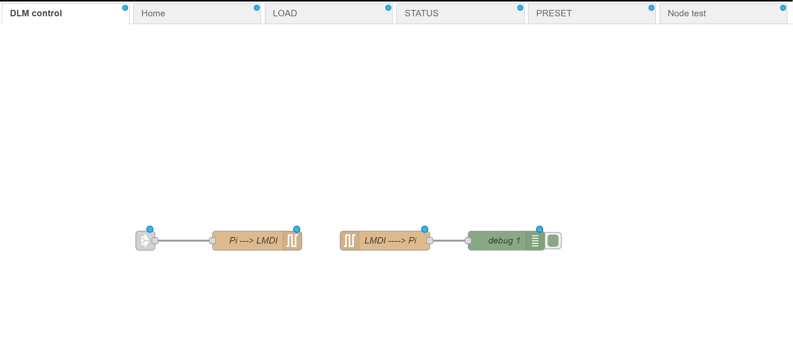
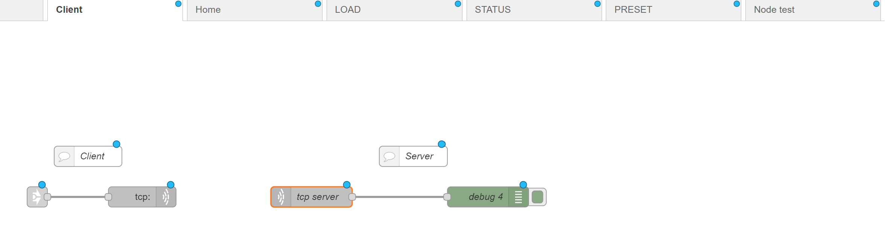

# About
This repository contains Node-RED flows designed to interface with digital light control systems using Raspberry Pi's communication protocols. The flows facilitate command transmission from Node-RED's user interface to a digital light controller, utilizing different communication methods in each version:

* Version 1 ('[flows_v1_uart.json](./flows_v1_uart.json)'): Implements the sending of LMDI-100 commands from Node-RED UI through Raspberry Pi's UART interface for Digital Light Control. This version is ideal for direct, serial-based communication setups.
  
  
* Version 2 ('[flows_v2_tcp.json](./flows_v2_tcp.json)'): Enhances the system by enabling the transmission of LMDI-100 commands from Node-RED UI through Raspberry Pi's TCP interface for Digital Light Control. This version is suited for network-based control scenarios, offering a more flexible and scalable solution.
  

# Setting up Node-RED
* Follow the instructions in [Node-RED_flow_import](https://flowfuse.com/blog/2023/03/3-quick-node-red-tips-5/#2.-import-helpful-example-flows-provided-with-custom-nodes)
