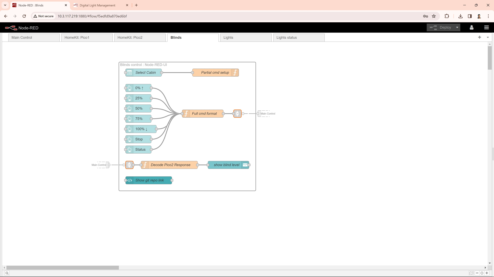

# About
This repository contains a Node-RED flow designed to interface with digital light control and window shading control systems using a Raspberry Pi and Pico-W. It includes both Apple HomeKit and Nodered-UI features, allowing you to control your smart home directly from your iOS or Android device.

## Working procedure
When running Node-RED with [SmartHome.json](./SmartHome.json) on a Raspberry Pi, the system becomes capable of sending light on/off commands suitable for LMDI-100 devices, and window covering commands compatible with Mechonet. Whenever an accessory in Apple HomeKit or Nodered-UI is used, it triggers a command from Node-RED on the Pi to write to a named pipe. These unique named pipes are created by the [ttpserver](https://github.com/RajkumarGara/pico-network-serial-port/blob/main/ttpserver.js) when each Pico-W connects to it via TCP. Commands written to the named pipe are then sent to the Pico-W by the ttpserver through TCP. Subsequently, the [Pico-W](https://github.com/RajkumarGara/pico-network-serial-port/blob/main/main.py) relays these commands to connected devices through RS232. The [`LMDI-100`](./docs/LMDI_Serial_Protocol.pdf) and [`Mechonet`](./docs/Mecho_Shade_Serial_Protocol.pdf) take input through RS232 to control digital lights or window blinds. This setup simplifies the management of multiple loads across an entire floor or building by deploying multiple Pico-W units in each room connected to the same WiFi network as the Raspberry Pi, allowing for centralized control. Additionally, it will also send commands to devices connected to the serial interface via the serial port of the Raspberry Pi.

## Features
1. Accessories can be operated through either Apple HomeKit or Nodered-UI.
2. It supports light and window covering accessories.
3. Number of accessories can be configured. (Refer [`Configure accessories`](#Configure-Accessories) section).
4. It sends LMDI-100, Mechonet commands to the Pico-W through the named pipe.
5. Individual and all lights on/off.
6. Individual light brightness control from 0 to 100%.
7. All window blinds 5-level (0%, 25%, 50%, 75%, 100%) covering.

## Installation
* Install [nodered on Raspberry-Pi](https://nodered.org/docs/getting-started/raspberrypi) by running the below command.
    ```bash
    bash <(curl -sL https://raw.githubusercontent.com/node-red/linux-installers/master/deb/update-nodejs-and-nodered)
    ```  
* Install [nodered-red-dashboard](https://flows.nodered.org/node/node-red-dashboard) by running the below commands.
    ```bash
    cd ~/.node-red
    npm i node-red-dashboard
    node-red-restart
    ```  
* Restart nodered to make changes take effect in Node-RED.
    ```bash
    node-red-restart
    ```
* Refer [NRCHKB](https://github.com/NRCHKB/node-red-contrib-homekit-bridged?tab=readme-ov-file#easy-install) to install HomeKit package on nodered.

## Running the Setup
* Follow the instructions in [import export flow](https://flowfuse.com/blog/2023/03/3-quick-node-red-tips-5/#1.-copy-and-share-your-flows-using-export-and-import) to import [`SmartHome.json`](./SmartHome.json) to the nodered.
* Follow the instructions in [pico-network-serial-port](https://github.com/RajkumarGara/pico-network-serial-port) to setup the Pico-W.

## Configure Accessories
* To add accessory, copy the existing accessory (for example: Dimmable Bulb).
* Increment/decrement the 'n' value (represents accessory number) in function node connected to the accessory.
* Add the accessory on your Apple device.

## Devloper Notes
* Instead of using [`SmartHome.json`](./SmartHome.json) to send commands through the serial port and named pipes, we can utilize [`TcpSmartHome.json`](./extras/TcpSmartHome.json) to communicate commands from the Raspberry-Pi to the Pico-W via TCP as shown below.
    

## Visual Overview
* This block diagram describes the complete project.
    

* Below screenshot shows the main control flow (sending commands through serial port as well as named pipe).
    

* This screenshot displays the window blinds control buttons within the Node-RED flow. The following one illustrates the same buttons within the Node-RED UI.
    

    

* This screenshot shows the light control buttons within the Node-RED flow. The following one illustrates the same buttons within the Node-RED UI.
    

    

* This screenshot shows the HomeKit accessories for Pico-W1 on nodered.
    

* This screenshot shows the HomeKit accessories for Pico-W2 on nodered. The following one illustrates the same buttons on iPad home.
    

    

## Credits
Special thanks to [Medical Informatics Engineering](https://www.mieweb.com/) for their support throughout the development of this project, especially to [Doug Horner](https://github.com/horner) for his invaluable guidance.